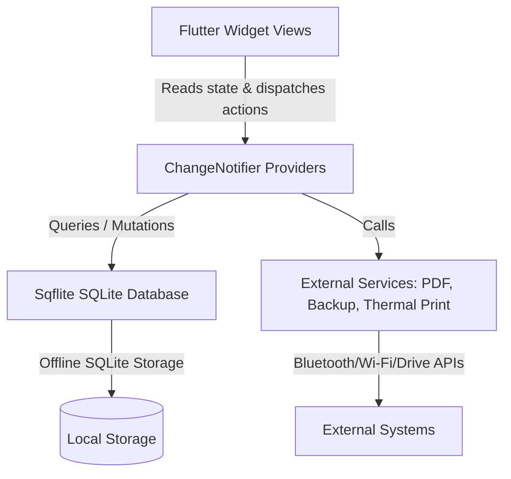

# System Architecture — Flutter Billing & POS Application

This document describes the architectural patterns, data flow, directory structure, and design principles implemented in this Offline-First POS & Billing Application.

## Architecture Pattern: Model-View-Provider (MVP / ChangeNotifier)

The application utilizes a decoupling model separating the UI layouts from the persistent database state and external services using the `provider` state management framework.



### 1. Presentation Layer (Views / Screens)
- Built entirely of declarative Flutter widgets.
- Contains no business logic or database queries directly.
- Listens to provider state mutations via `context.watch<T>()` or `Consumer<T>`, and invokes operations on them using `context.read<T>()` in user event handlers (e.g. tap gestures).

### 2. State & Business Logic Layer (Providers)
- Located in `lib/providers/`.
- Inherits from `ChangeNotifier`.
- Manages transactional business logic (cart calculations, inventory state, thermal printer streams, Backup triggers).
- Emits `notifyListeners()` when data mutations occur, prompting reactive UI updates.

### 3. Data & Storage Layer (Models & Database helper)
- Core domain model definitions located in `lib/models/`. Includes schema translation helpers (`toMap()`, `fromMap()`, `copyWith()`).
- Database helper `lib/data/db_helper.dart` coordinates SQLite database lifecycle, migrations, atomic transactions, and raw connections.

### 4. Service Layer (External Integrations)
- Located in `lib/services/`.
- Isolated classes designed to handle hardware and cloud integrations:
  - `PdfService`: Compiles and exports PDF documents.
  - `PrinterProvider`: Manages TCP sockets and Bluetooth channels for printing receipts.
  - `BackupProvider`: Compiles local SQLite file bytes, runs PBKDF2 key derivation, performs AES-256 encryption/decryption, and integrates with the Google Drive API.

---

## Directory Layout

```
lib/
├── data/                  # SQLite helper and table configurations
│   └── db_helper.dart
├── models/                # Symmetrical Domain Models
│   ├── business.dart
│   ├── category.dart
│   ├── invoice.dart
│   ├── invoice_item.dart
│   ├── product.dart
│   └── stock_movement.dart
├── providers/             # ChangeNotifier controllers (Business Logic)
│   ├── auth_provider.dart
│   ├── backup_provider.dart
│   ├── business_provider.dart
│   ├── cart_provider.dart
│   ├── invoice_provider.dart
│   ├── printer_provider.dart
│   └── product_provider.dart
├── screens/               # Flutter widgets (Presentation UI)
│   ├── barcode_scanner_screen.dart
│   ├── dashboard_screen.dart
│   ├── inventory_screen.dart
│   ├── invoice_detail_sheet.dart
│   ├── navigation_shell.dart
│   ├── onboarding_screen.dart
│   ├── pos_billing_screen.dart
│   ├── product_management_screen.dart
│   ├── reports_screen.dart
│   └── settings_screen.dart
├── services/              # Pure business services
│   └── pdf_service.dart
└── main.dart              # MultiProvider setup & Global Theme definition
```

---

## Key Design Principles

1. **Strict Offline-First**: All CRUD operations, inventory management, and invoice checkouts occur directly on SQLite. No network latency affects checkout speed.
2. **Encrypted Backups**: Google Drive uploads are fully encrypted client-side using a user-defined passphrase, ensuring that no plain text transactional data is stored in the cloud.
3. **Hardware Independence**: Printers can be added dynamically via Bluetooth (paired natively in Android settings) or via network IP address (standard Wi-Fi/LAN printer socket connection).
