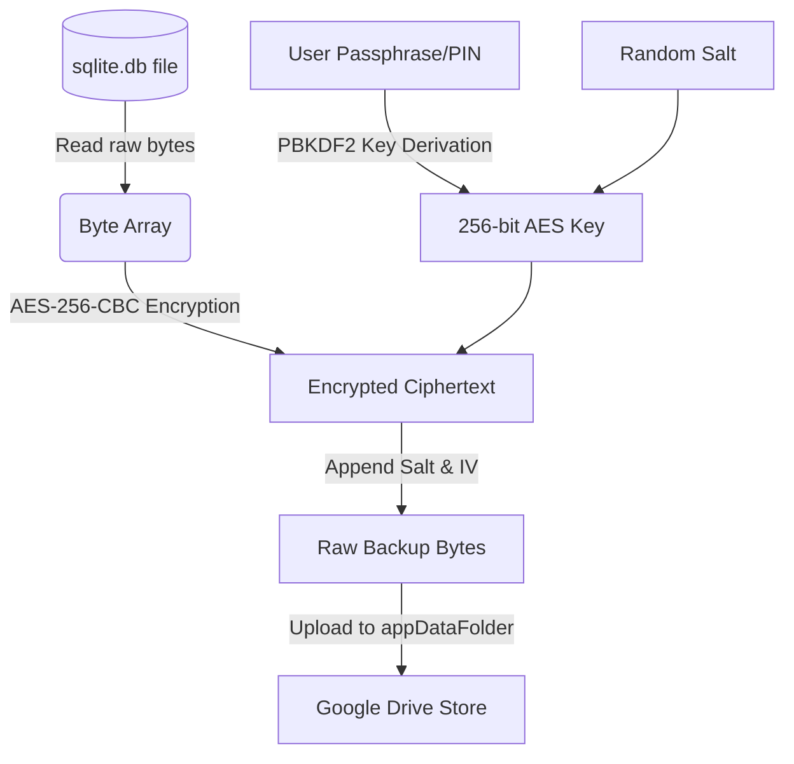

# Google Drive Backup & Recovery Systems

This document explains the cryptographic security, data structures, and authorization flows used in our backup/restore features.

## Cryptographic Security (Client-Side Encryption)

We enforce client-side encryption. The raw database file is encrypted *before* it leaves the device. Google or any middleman never sees plain text transactional/customer logs.

### Encryption Protocol Specifications
- **Key Derivation Function**: PBKDF2 (Password-Based Key Derivation Function 2) using HMAC-SHA256. Runs 10,000 iterations to generate a cryptographically strong 256-bit key from the user's PIN/passphrase.
- **Encryption Algorithm**: AES-256-CBC (Advanced Encryption Standard in Cipher Block Chaining mode).
- **Padding Scheme**: PKCS7 padding.
- **Salt & IV**: Generated uniquely using cryptographically secure random bytes (`Fortuna` generator via PointyCastle). The salt is prepended to the file payload so the decryption program can rebuild the exact key representation.

---

## Google OAuth & Drive Authentication

1. **Authorization Scopes**:
   - The app requests the `https://www.googleapis.com/auth/drive.appdata` scope.
   - This restricts the app to a special hidden sandbox directory inside the user's Google Drive. The app cannot read, write, or view any personal files (documents, pictures) in the user's primary storage.

2. **Access Token Handshake**:
   - Google Sign-In is initiated on the client.
   - Upon authentication, we retrieve the authenticated HTTP client wrapper using `extension_google_sign_in_as_googleapis_auth`.
   - The Drive REST API client consumes the credentials and targets query operations directly on the secure `appDataFolder`.

---

## Recovery and Rollback Guardrails

To prevent data corruption during restoration:
1. **Verification Phase**:
   - The user inputs the passphrase/PIN.
   - The system downloads the encrypted file from Drive, parses the salt, derives the key, and runs the decryption algorithm.
   - If the key is incorrect, PKCS7 pad verification fails, or the header is corrupted, the restore operation immediately terminates and notifies the user (no local data is changed).

2. **Atomic Rollback**:
   - If decryption is successful, the app closes the active SQLite database connections.
   - The decrypted database bytes are written to a temporary storage path (`temp_restore.db`).
   - The file system swaps the current active database file with the new file.
   - If any disk error occurs during the swap, the operation rolls back to the old database file, ensuring the app never launches with a broken or empty database.
   - Finally, all state providers (`ProductProvider`, `InvoiceProvider`, `BusinessProvider`) are ordered to invalidate their memory caches and run `loadProducts()`, `loadInvoices()`, and `loadBusiness()` to hot-reload the UI.
