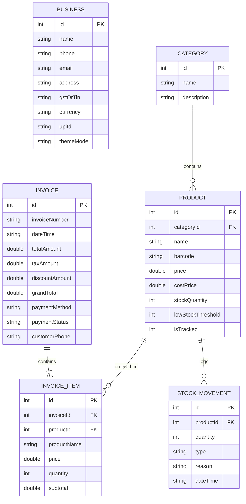

# Database Schema & Storage Design — SQLite Offline-First

This document outlines the SQLite schema, indexes, tables, relationships, and transactional rollback mechanisms used to ensure data integrity.

## Entity Relationship Diagram



---

## Tables & Schemas

### 1. `business`
Stores the single-row business configuration, credentials, currency symbol, UPI address, and custom layouts.
- **Primary Key**: `id INTEGER PRIMARY KEY AUTOINCREMENT`
- **Fields**: `name`, `phone`, `email`, `address`, `gstOrTin`, `currency`, `upiId`, `themeMode`

### 2. `categories`
Provides classification structure for Products.
- **Primary Key**: `id INTEGER PRIMARY KEY AUTOINCREMENT`
- **Fields**: `name TEXT NOT NULL`, `description TEXT`

### 3. `products`
The core catalog table.
- **Primary Key**: `id INTEGER PRIMARY KEY AUTOINCREMENT`
- **Foreign Key**: `categoryId` references `categories(id) ON DELETE SET NULL`
- **Fields**: `name TEXT NOT NULL`, `barcode TEXT UNIQUE`, `price REAL`, `costPrice REAL`, `stockQuantity INTEGER`, `lowStockThreshold INTEGER`, `isTracked INTEGER` (0/1)

### 4. `invoices`
Sales ledger container.
- **Primary Key**: `id INTEGER PRIMARY KEY AUTOINCREMENT`
- **Fields**: `invoiceNumber TEXT UNIQUE`, `dateTime TEXT`, `totalAmount REAL`, `taxAmount REAL`, `discountAmount REAL`, `grandTotal REAL`, `paymentMethod TEXT`, `paymentStatus TEXT`, `customerPhone TEXT`

### 5. `invoice_items`
Child table of transactions.
- **Primary Key**: `id INTEGER PRIMARY KEY AUTOINCREMENT`
- **Foreign Keys**: 
  - `invoiceId` references `invoices(id) ON DELETE CASCADE`
  - `productId` references `products(id) ON DELETE RESTRICT`
- **Fields**: `productName TEXT`, `price REAL`, `quantity INTEGER`, `subtotal REAL`

### 6. `stock_movements`
Ledger of all additions, manual overrides, and sales deductions for stock-tracked products.
- **Primary Key**: `id INTEGER PRIMARY KEY AUTOINCREMENT`
- **Foreign Key**: `productId` references `products(id) ON DELETE CASCADE`
- **Fields**: `quantity INTEGER`, `type TEXT` (IN / OUT), `reason TEXT`, `dateTime TEXT`

---

## Indexing for Optimization
To ensure fast searches when the transaction history grows to thousands of records, we create indexing directives on key lookups:
- `idx_products_barcode` on `products(barcode)`
- `idx_invoices_number` on `invoices(invoiceNumber)`
- `idx_invoice_items_invoice` on `invoice_items(invoiceId)`

---

## Transactional Integrity & Rollbacks

When checking out, multiple database operations must succeed atomically:
1. Insert the invoice header.
2. Insert each item in the cart as an `invoice_item`.
3. Decrement the `stockQuantity` in `products` for tracked products.
4. Record a stock movement log of type `OUT` for each item.

If any of these inserts fail (e.g. invalid foreign key, database lock, constraints violation), a partial transaction would corrupt the database.

**Our Checkout Solution**:
All checkout SQL queries are executed inside a database transaction block:
```dart
await db.transaction((txn) async {
  // 1. Insert invoice header
  final invoiceId = await txn.insert('invoices', invoice.toMap());
  
  // 2. Loop through items
  for (var item in items) {
    await txn.insert('invoice_items', item.toMap());
    
    // 3. Decrement stock
    await txn.rawUpdate('''
      UPDATE products 
      SET stockQuantity = stockQuantity - ? 
      WHERE id = ? AND isTracked = 1
    ''', [item.quantity, item.productId]);
  }
});
```
If an exception is thrown inside the `transaction` block, SQLite automatically rolls back all actions, restoring the exact state prior to checkout.
