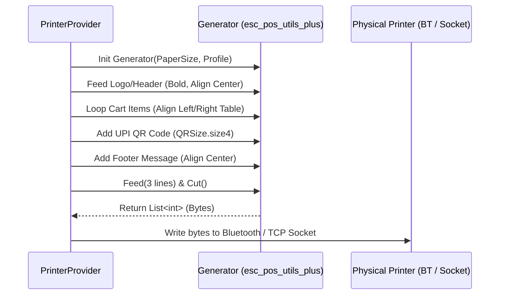

# Thermal Printing Integration Guide

This guide explains how the thermal printing sub-system communicates with 58mm and 80mm ESC/POS hardware interfaces.

## Supported Interfaces

1. **Bluetooth (Class 2 / BLE)**
   - Utilizes the `print_bluetooth_thermal` plugin.
   - Scan discovers nearby paired printers.
   - The user selects a device, which establishes a serial-port profile RFCOMM connection to exchange binary data.

2. **Network Wi-Fi / Ethernet LAN**
   - Directly opens a raw TCP socket client using Dart's `Socket.connect()` on port `9100` (standard RAW print port for POS hardware).
   - Writes print bytes directly to the socket and flushes. No drivers required.

---

## Page Width Configuration

Printers process lines in raw pixel dots. The app supports two standard paper widths:

| Paper Size | Character Max (Normal) | Recommended Font Size | ESC/POS Code Width |
| :--- | :--- | :--- | :--- |
| **58mm** | 32 characters | small / medium | `PaperSize.mm58` |
| **80mm** | 48 characters | normal / bold | `PaperSize.mm80` |

---

## ESC/POS Printing Flow

The receipt payload is constructed as a stream of raw print bytes using the `esc_pos_utils_plus` builder:



### Formatting Code Sample (Bytes Compilation)

```dart
final profile = await CapabilityProfile.load();
final generator = Generator(paperSize, profile);
List<int> bytes = [];

// Header
bytes += generator.text('SUPERSTORE MART', styles: PosStyles(align: PosAlign.center, bold: true));
bytes += generator.text('Tel: 9876543210', styles: PosStyles(align: PosAlign.center));
bytes += generator.hr();

// Columns (Align Item left, Qty/Price right)
bytes += generator.row([
  PosColumn(text: 'ItemDescription', width: 6),
  PosColumn(text: 'Qty', width: 2, align: PosAlign.right),
  PosColumn(text: 'Price', width: 4, align: PosAlign.right),
]);
```

---

## UPI QR Code Printing
The printer generates QR codes dynamically using hardware-level commands:
- **Encoding**: URL payload formatted as standard pay-to-address scheme: `upi://pay?pa=address@bank&pn=ShopName&am=TotalAmount&cu=INR`
- **QR Command**: Compiles to command byte matrices (`generator.qrcode()`), configuring sizing (e.g. `size4` representing a 4x4 matrix density fit on 58mm/80mm layouts).

---

## Troubleshooting Printer Issues

### 1. Bluetooth Discovery Empty
- Ensure the printer is paired inside Android OS settings *first*.
- Grant Bluetooth Location permissions to the app when prompted (required on older Android versions for Bluetooth discovery).

### 2. Output is Garbage / gibberish text
- The printer Capability Profile is mismatched. Check if the printer supports `ESC/POS` emulation. Most unbranded thermal printers use standard `Star` or `Epson` profiles (default settings).
- Adjust the print paper size in settings (58mm vs 80mm). Sending 80mm rows to 58mm layouts wraps lines abnormally.
